# Monte Carlo Entropy–CRITIC Ensemble Weighting Strategy

**Status:** Design specification — finalized for implementation  
**Replaces:** 4-method GTWC pipeline (Entropy + SD + CRITIC + MEREC + Game Theory + Bayesian Bootstrap)  
**Scope:** Full two-level hierarchical weight calculation — Level 1: 29 SC local weights per criterion group; Level 2: 8 criterion global weights (63 provinces × 14 years)

---

## 1. Executive Summary

This project uses a **two-level hierarchical MCDM system**:

- **Level 1 — Within-criterion sub-criteria weights:** For each of 8 criterion groups (C01–C08), the local importance of each SC column within that group must be determined (e.g. how important is SC11 vs SC12 vs SC13 vs SC14 inside C01). These local weights drive the 12 MCDM methods in Stage 1 ranking.
- **Level 2 — Criterion weights:** The relative global importance of C01–C08 must be determined. These weights drive Stage 2 Evidential Reasoning aggregation.

The new strategy computes **both levels independently** using a single **Probabilistic Monte Carlo Ensemble** built around two philosophically complementary objective weighting methods:

- **Shannon Entropy**: measures *within-criterion information content* - assigns higher weight to criteria with greater discriminating power (variance) across alternatives.
- **CRITIC**: measures *contrast intensity × inter-criteria independence* — rewards criteria that are both highly variable AND uncorrelated with other criteria.

For each hierarchical level, the ensemble:

1. **Perturbs the decision data** via panel-aware block bootstrap + column-wise log-normal multiplicative noise.
2. **Samples a blending parameter** $\beta \sim \text{Beta}(\alpha_a, \alpha_b)$ each simulation to combine Entropy and CRITIC weights probabilistically.
3. **Collects weight and ranking distributions** across all simulations for full uncertainty quantification.
4. **Tunes** the Beta and noise hyperparameters to maximize ranking stability (Kendall's $\tau_b$) under perturbation.

**Blend formula (primary - linear):** $\mathbf{w}^{(s)} = \beta^{(s)} \mathbf{w}_E^{(s)} + (1{-}\beta^{(s)}) \mathbf{w}_C^{(s)}$  
**Fallback formula (multiplicative):** activated automatically if linear blend fails numerically - $w_j^{(s)} \propto w_{E,j}^{(s)} \cdot w_{C,j}^{(s)}$

---

## 2. Hierarchical System Architecture

### 2.1 Two-Level Hierarchy

```
  LEVEL 2 (ER Stage 2)
  +------+------+------+------+------+------+------+------+
  | C01 | C02 | C03 | C04 | C05 | C06 | C07 | C08 |   <- 8 criteria
  |w_C1 |w_C2 |w_C3 |w_C4 |w_C5 |w_C6 |w_C7 |w_C8 |   <- Level 2 weights
  +--+---+--+---+--+---+--+---+--+---+--+---+--+---+--+---+
    |    |    |    |    |    |    |    |
  LEVEL 1 (MCDM Stage 1 — within each criterion group)
  [SC11   [SC21   [SC31   [SC41   [SC51   [SC61   [SC71   [SC81
   SC12    SC22    SC32    SC42    SC52    SC62    SC72    SC82
   SC13    SC23    SC33    SC43    SC53    SC63    SC73    SC83]
   SC14]   SC24]           SC44]   SC54]   SC64]
  4 SCs   4 SCs   3 SCs   4 SCs   4 SCs   4 SCs   3 SCs   3 SCs
```

| Level | Weights Produced | Used In | Matrix Input |
|---|---|---|---|
| Level 1 | Local SC weights per group (sum to 1 within Ck) | Stage 1: 12 MCDM methods per criterion | m × n_k sub-criteria data for Ck |
| Level 2 | Criterion weights C01..C08 (sum to 1 globally) | Stage 2: Evidential Reasoning aggregation | m × 8 criterion composite matrix |

### 2.2 Data Context and Constraints

| Property | Value |
|---|---|
| Provinces (m) | 63 |
| Years (T) | 2011–2024 (14 years) |
| Level 1 groups | 8 criteria (C01–C08) |
| Level 1 SCs per group | 4, 4, 3, 4, 4, 4, 3, 3 = 29 total |
| Level 2 criteria | 8 columns (criterion composite scores) |
| Criteria type | All benefit (higher is better, both levels) |
| Panel structure | Long-format (`Province`, `Year`, SC columns) |
| Normalization | Global min-max applied inside the ensemble |

**Governing constraints:**

1. **Temporal panel dependence**: Province observations across years are correlated. Cross-sectional block bootstrap (resample whole province blocks) is the statistically valid exchangeability unit.
2. **Positivity**: Entropy and CRITIC require strictly positive inputs. Log-normal multiplicative noise preserves positivity; additive Gaussian does not.
3. **Benefit-only panel**: No direction reversal required at either level.
4. **Dynamic exclusion pre-filtering**: `pipeline.py` drops all-NaN SC columns and incomplete province-year rows before calling this class. The class always receives a clean matrix.
5. **Level 2 composite construction**: The criterion composite matrix (input to Level 2) is built from Level 1 *local* weights applied to the SC cross-section - not from precomputed composite columns. This ensures consistency between the two levels.

## 3. Workflow Flowchart

The following Mermaid diagram shows how all functions and components work together from raw data to final `WeightResult`:

```mermaid
flowchart TD
    A["panel_df\nProvince × Year × SC columns\n(pre-cleaned by pipeline.py)"]
    --> B["STEP 0 · Data Preparation\nbuild province_blocks dict\nX_raw m×29"]

    B --> C["STEP 1 · Baseline Weights\nEntropyWeightCalculator on full X\nCRITICWeightCalculator on full X\nW_base = (W_E + W_C) / 2\nr_base = SAW baseline ranking"]

    C --> D{"config.perform_tuning?"}
    D -- Yes --> E["_tune_hyperparameters()\nGrid search 4×4×4 = 64 points\nN_tune=500 per point\nObjective: AvgKendall τ_b\n± Bayesian GP refinement"]
    E --> F["θ* = best (α_a, α_b, σ_scale)"]
    D -- No --> F2["θ* = config defaults\nalpha_a, alpha_b, sigma_scale"]
    F --> G
    F2 --> G

    subgraph LEVEL1["LEVEL 1 · Per-Criterion MC Ensemble (×8 groups)"]
      G["For each C_k in C01..C08\nextract X_k  m × n_k sub-matrix"]
      --> H["_run_mc_ensemble( X_k, province_blocks, θ* )\nBlock bootstrap + log-normal noise per sim\nEntropy + CRITIC on perturbed X_k^(s)\nβ^(s) ~ Beta(α_a, α_b)\nLinear blend → auto-fallback to multiplicative\nSAW rank r^(s) for stability tracking"]
      --> I["local_weights[C_k]\nn_k weights summing to 1 within C_k\n+ per-group MC diagnostics"]
    end

    I --> J["Build Criterion Composite Matrix  m × 8\ncomposite(i, C_k) = Σ_j local_w_j^(C_k) · x_ij\nfor each province i"]

    subgraph LEVEL2["LEVEL 2 · Criterion MC Ensemble"]
        J --> K["_run_mc_ensemble( composite_matrix, province_blocks, θ* )\nSame block bootstrap + noise procedure\nEntropy + CRITIC on perturbed composite^(s)\nβ^(s) ~ Beta(α_a, α_b)\nLinear blend → auto-fallback to multiplicative\nSAW rank r^(s) for stability tracking"]
        --> L["criterion_weights\nC01..C08 weights summing to 1 globally\n+ Level 2 MC diagnostics"]
    end

    L --> M["Compute Global SC Weights\nglobal_w[SC_j] = local_w[SC_j in C_k] × criterion_w[C_k]\nRe-normalise → Σ = 1"]

    M --> N["temporal_stability_verification()\nSplit-half test via TemporalStabilityValidator\nCallback uses θ*, perform_tuning=False, N=200"]

    N --> O["WeightResult\nweights: 29 global SC weights → pipeline.py\nmethod: 'monte_carlo_ensemble'\ndetails: level1 + level2 + global_sc_weights\n+ hyperparameters + stability + metadata"]
```



---

## 4. Mathematical Framework

### 4.1 Notation

| Symbol | Definition |
|---|---|
| $m$ | Number of alternatives (provinces after NaN exclusion) |
| $K$ | Number of criterion groups = 8 (C01–C08) |
| $n_k$ | Number of SCs in group $k$: $[4,4,3,4,4,4,3,3]$ |
| $p = \sum_k n_k$ | Total active sub-criteria = 29 |
| $X_k \in \mathbb{R}^{m \times n_k}$ | Level 1 sub-matrix for criterion group $k$ |
| $Z \in \mathbb{R}^{m \times K}$ | Level 2 criterion composite matrix |
| $\mathbf{u}_k \in \Delta^{n_k}$ | Level 1 local SC weights within group $k$ (sum to 1) |
| $\mathbf{v} \in \Delta^K$ | Level 2 criterion weights (sum to 1 globally) |
| $\mathbf{w} \in \Delta^p$ | Global SC weights: $w_j = u_{k,j} \cdot v_k$ for SC $j \in k$ |
| $\mathbf{w}_E \in \Delta^p$ | Entropy weight vector (per-level baseline) |
| $\mathbf{w}_C \in \Delta^p$ | CRITIC weight vector (per-level baseline) |
| $\beta^{(s)} \in [0,1]$ | Blending parameter for simulation $s$ |
| $\mathbf{w}^{(s)} \in \Delta^p$ | Per-simulation hybrid weight vector |
| $\mathbf{r}^{(s)} \in \mathbb{Z}^m$ | Per-simulation province ranking vector |
| $\Delta^p$ | Probability simplex: $\{w \in \mathbb{R}^p : w_j \geq 0, \sum_j w_j = 1\}$ |
| $N$ | Number of Monte Carlo simulations per level |
| $N_{\text{tune}}$ | MC simulations per hyperparameter tuning point |
| $B$ | Number of provinces (block bootstrap units) = 63 |

### 4.2 Level 1 - Local SC Weights Per Criterion Group

For each criterion group $k \in \{1,\ldots,K\}$ with sub-matrix $X_k \in \mathbb{R}^{m \times n_k}$:

**Step 1 - Normalize:**
$$\tilde{X}_k = \text{GlobalMinMax}(X_k, \varepsilon), \quad \tilde{x}_{ij} = \frac{x_{ij} - \min_j(X_k)}{\max_j(X_k) - \min_j(X_k)} + \varepsilon$$

**Step 2 - Entropy weights:**
$$p_{ij} = \frac{\tilde{x}_{ij}}{\sum_{i'} \tilde{x}_{i'j}}, \quad E_j = -\frac{1}{\ln m} \sum_{i=1}^{m} p_{ij} \ln(p_{ij} + \varepsilon)$$
$$u_{E,j}^{(k)} = \frac{1 - E_j}{\sum_{j'=1}^{n_k} (1 - E_{j'})}, \quad \mathbf{u}_E^{(k)} \in \Delta^{n_k}$$

**Step 3 - CRITIC weights:**
$$C_j = \sigma_j \sum_{j'=1}^{n_k} (1 - r_{jj'}), \quad u_{C,j}^{(k)} = \frac{C_j}{\sum_{j''} C_{j''}}, \quad \mathbf{u}_C^{(k)} \in \Delta^{n_k}$$

**Step 4 - MC ensemble blend (per simulation $s$):**
$$\beta^{(s)} \sim \text{Beta}(\alpha_a, \alpha_b), \quad \mathbf{u}^{(k,s)} = \beta^{(s)} \mathbf{u}_E^{(k,s)} + (1-\beta^{(s)}) \mathbf{u}_C^{(k,s)}$$

**Output:** Posterior mean $\bar{\mathbf{u}}_k = \frac{1}{N} \sum_s \mathbf{u}^{(k,s)} \in \Delta^{n_k}$, with $\sum_{j=1}^{n_k} \bar{u}_{k,j} = 1$.

### 4.3 Level 2 - Criterion Composite Matrix Construction

After Level 1 completes for all $k$, build the criterion composite matrix $Z \in \mathbb{R}^{m \times K}$:

$$z_{ik} = \sum_{j \in \text{SC}_k} \bar{u}_{k,j} \cdot x_{ij}, \quad i = 1,\ldots,m, \quad k = 1,\ldots,K$$

where $x_{ij}$ are the raw (pre-normalization) SC values and $\bar{u}_{k,j}$ are the Level 1 posterior-mean local weights.

> **Design rationale:** The composite score $z_{ik}$ is a weighted sum of the SC sub-matrix for criterion $k$, weighted by Level 1 local importance. This converts the $m \times 29$ SC panel into an $m \times 8$ criterion-level panel that represents each criterion as a single score per province. The Level 2 MC ensemble then estimates how important each criterion is *relative to the others*, independently of the SC-level weights.

**Level 2 MC ensemble** runs on $Z$ with the same protocol as Level 1:
$$\bar{\mathbf{v}} = \frac{1}{N} \sum_{s=1}^{N} \mathbf{v}^{(s)} \in \Delta^K, \quad \text{with } \sum_{k=1}^{K} \bar{v}_k = 1$$

### 4.4 Global SC Weights

The final global SC weight for sub-criterion $j$ in group $k$ is:

$$w_j = \bar{u}_{k,j} \cdot \bar{v}_k, \quad j \in \text{SC}_k$$

**Simplex property:**

$$\sum_{k=1}^{K} \sum_{j \in \text{SC}_k} w_j = \sum_{k=1}^{K} \bar{v}_k \underbrace{\sum_{j \in \text{SC}_k} \bar{u}_{k,j}}_{=1} = \sum_{k=1}^{K} \bar{v}_k = 1$$

These 29 global weights $\mathbf{w} \in \Delta^{29}$ are returned as `WeightResult.weights` and passed directly to `HierarchicalRankingPipeline.rank(subcriteria_weights=...)`.

### 4.5 Perturbation Model (both Level 1 and Level 2)

The `_run_mc_ensemble` function applies the same two-component perturbation to whatever matrix it receives (either $X_k$ or $Z$):

**Component 1 - Cross-sectional block bootstrap:**

Let $\mathcal{I} = \{1, \ldots, B\}$ be the 63 province indices. Each province forms a *block* of all its year-rows. For simulation $s$:

$$\mathcal{I}^{(s)} \sim \text{Multinomial}(B;\, 1/B, \ldots, 1/B) \text{ with replacement}$$

The resampled matrix stacks all year-rows for each selected province block, preserving within-province temporal structure.

> **Why cross-sectional block bootstrap?** Simple row bootstrap breaks temporal correlation within each province. The ranking is *of provinces*, so the bootstrap exchangeability unit is the province. Resampling complete province blocks is exchangeable under the null that provinces are i.i.d. draws from a population (Kunsch, 1989; Politis & Romano, 1994).

**Component 2 - Column-wise log-normal multiplicative noise:**

$$X^{(s)}_{ij} = X^{(s)}_{\text{boot},ij} \times \exp\!\left(\varepsilon_{ij}^{(s)}\right), \quad \varepsilon_{ij}^{(s)} \sim \mathcal{N}\!\left(0,\, \sigma_{\text{scale}}^2 \cdot \hat{\sigma}_j^2 \right)$$

where $\hat{\sigma}_j$ is the sample std of column $j$ after global normalization.

> **Why log-normal multiplicative noise?** Additive Gaussian noise can produce negatives, violating the positivity assumption of Entropy and CRITIC. Log-normal multiplicative noise preserves positivity: $X^{(s)} = X_{\text{boot}} \odot e^E > 0$ always. It is the natural perturbation model for positive socioeconomic measurements.

### 4.6 Per-Simulation Weight Blend

For each simulation $s = 1, \ldots, N$:

1. **Apply perturbation** (bootstrap + noise) - see §4.5.
2. **Normalize:** $\tilde{X}^{(s)} = \text{GlobalMinMax}(X^{(s)}, \varepsilon)$.
3. **Compute:** $\mathbf{w}_E^{(s)} = \text{Entropy}(\tilde{X}^{(s)})$, $\mathbf{w}_C^{(s)} = \text{CRITIC}(\tilde{X}^{(s)})$.
4. **Sample:** $\beta^{(s)} \sim \text{Beta}(\alpha_a, \alpha_b)$.
5. **Linear blend (primary):**

$$\mathbf{w}^{(s)}_{\text{raw}} = \beta^{(s)} \mathbf{w}_E^{(s)} + (1 - \beta^{(s)}) \mathbf{w}_C^{(s)}, \quad \mathbf{w}^{(s)} = \mathbf{w}^{(s)}_{\text{raw}} / \|\mathbf{w}^{(s)}_{\text{raw}}\|_1$$

> Proof of simplex membership: since $\mathbf{w}_E^{(s)}, \mathbf{w}_C^{(s)} \in \Delta^p$ and $\beta^{(s)} \in [0,1]$, their convex combination is in $\Delta^p$ exactly. Re-normalization is a floating-point safety step only.

6. **Multiplicative fallback (automatic, triggered only on numerical failure):**

If the linear blend raises any exception *or* produces a non-positive sum (numerical degeneration), the simulation automatically falls back to:

$$w_j^{(s)} = \frac{w_{E,j}^{(s)} \cdot w_{C,j}^{(s)}}{\sum_{k} w_{E,k}^{(s)} \cdot w_{C,k}^{(s)}}$$

This is not a configurable mode - it is a silent numeric recovery path. A sub-criterion must score highly in *both* methods to receive high weight under this formula, making it more conservative. The `epsilon` clip inside each calculator prevents zero-denominator crashes.

7. **SAW surrogate ranking:**

$$S_i^{(s)} = \sum_j w_j^{(s)} \tilde{x}_{ij}^{(s)}, \quad \mathbf{r}^{(s)} = \text{rank}(-\mathbf{S}^{(s)})$$

Used for stability tracking; SAW is the linear scorer with maximum sensitivity to weight changes, making it the correct fast surrogate for detecting weight-induced rank instability.

---

## 5. Robustness Metrics

The following metrics are computed from the $N$ simulation results $\{(\mathbf{w}^{(s)}, \mathbf{r}^{(s)})\}_{s=1}^{N}$.

### 5.1 Weight-Level Metrics (per sub-criterion $j$)

| Metric | Formula | Purpose |
|---|---|---|
| Posterior mean | $\bar{w}_j = \frac{1}{N} \sum_s w_j^{(s)}$ | Point estimate |
| Posterior std | $\hat{\sigma}_{w_j} = \sqrt{\frac{1}{N-1}\sum_s (w_j^{(s)} - \bar{w}_j)^2}$ | Weight uncertainty |
| 95% ETI lower | $\hat{q}_{0.025}(w_j)$ via `np.percentile` | Credible interval lower |
| 95% ETI upper | $\hat{q}_{0.975}(w_j)$ via `np.percentile` | Credible interval upper |
| Coefficient of variation | $\text{CV}_j = \hat{\sigma}_{w_j} / \bar{w}_j$ | Relative uncertainty |

> **Equal-tailed interval (ETI)** is used rather than HDI because: (a) the weight posterior is expected to be unimodal and near-symmetric; (b) ETI is the standard for bootstrap credible intervals (Davison & Hinkley, 1997); (c) numerically simpler. For $N = 2000$, the MCSE of the 2.5th percentile is $\approx 0.011\,\hat{\sigma}_{w_j}$, negligible in practice.

### 5.2 Ranking-Level Metrics (primary robustness objective for tuning)

**Average Kendall's $\tau_b$ against baseline:**

$$\text{AvgKendall} = \frac{1}{N} \sum_{s=1}^{N} \tau_b\!\left(\mathbf{r}^{(0)}, \mathbf{r}^{(s)}\right)$$

Kendall's $\tau_b$ handles ties via its correction term and is more appropriate than Spearman's $\rho$ for MCDM rankings because it measures concordance of *pairwise orderings*. Range $[-1, 1]$; target $\geq 0.85$.

**Kendall's $W$ (overall concordance across all $N$ simulations):**

$$W = \frac{12 \sum_{i=1}^{m} \left(\sum_{s=1}^{N} r_i^{(s)} - \frac{N(m+1)}{2}\right)^2}{N^2(m^3 - m)}$$

Range $[0, 1]$; $W \geq 0.7$ is acceptable. A chi-squared test on $W$ with $p < 0.05$ confirms statistical significance (Kendall & Babington Smith, 1939).

**Top-K rank variance:**

$$\text{TopKVar} = \frac{1}{K} \sum_{i \in \text{Top-}K} \text{Var}_s\!\left[r_i^{(s)}\right]$$

where Top-$K$ is the set of $K$ provinces with lowest mean rank across simulations. Default $K = 10$. Target $< 2.0$.

**Pairwise win probability matrix** $\mathbf{P} \in [0,1]^{m \times m}$:

$$P_{ij} = \frac{1}{N} \sum_{s=1}^{N} \mathbf{1}\!\left[r_i^{(s)} < r_j^{(s)}\right]$$

By construction $P_{ij} + P_{ji} = 1$ (ties assigned 0.5). Stored in `details['level2']['mc_diagnostics']['rank_win_matrix']`.

**Province rank distribution (per-province):**

| Statistic | Formula |
|---|---|
| `mean_rank[i]` | $\bar{r}_i = \frac{1}{N}\sum_s r_i^{(s)}$ |
| `std_rank[i]` | $\hat{\sigma}_{r_i} = \sqrt{\frac{1}{N-1}\sum_s(r_i^{(s)}-\bar{r}_i)^2}$ |
| `prob_top1[i]` | $\frac{1}{N}\sum_s \mathbf{1}[r_i^{(s)} = 1]$ |
| `prob_topK[i]` | $\frac{1}{N}\sum_s \mathbf{1}[r_i^{(s)} \leq K]$ |

### 5.3 Convergence Criterion

After every `conv_check_every = max(10, N//20)` successful iterations (starting from `conv_min_iters = max(30, N//6)`):

$$\delta^{(b)} = \|\bar{\mathbf{w}}^{(b)} - \bar{\mathbf{w}}^{(b-1)}\|_\infty < \delta_{\text{tol}} = 5 \times 10^{-5}$$

Two consecutive checks passing triggers early termination; `converged_at` is recorded.

---

## 6. Hyperparameter Specification

| Parameter | Symbol | Default | Search Range | Role |
|---|---|---|---|---|
| Beta shape 1 | $\alpha_a$ | 1.0 | [0.5, 5.0] | Controls $\beta$ distribution towards Entropy |
| Beta shape 2 | $\alpha_b$ | 1.0 | [0.5, 5.0] | Controls $\beta$ distribution towards CRITIC |
| Noise scale | $\sigma_{\text{scale}}$ | 0.02 | [0.005, 0.15] | Log-normal noise magnitude |
| Bootstrap fraction | $f_{\text{boot}}$ | 1.0 | {0.8, 1.0} | Province bootstrap resample ratio |
| MC simulations | $N$ | 2000 | 500–5000 | Inference iterations per level |
| Tuning simulations | $N_{\text{tune}}$ | 500 | 200–1000 | Per-grid-point MC count |
| Top-K for stability | $K$ | 10 | 5–20 | Rank variance window |

> **Note:** There is no `blend_mode` parameter. The linear blend is always primary; multiplicative is a silent numeric fallback. This is not configurable.

**Interpretation of Beta parameters:**

| $(\alpha_a, \alpha_b)$ | $\mathbb{E}[\beta]$ | Effect |
|---|---|---|
| (1, 1) | 0.5 | Uniform prior - equal treatment of both methods |
| (2, 2) | 0.5 | Concentrated near equal blend |
| (3, 1) | 0.75 | Entropy-dominant |
| (1, 3) | 0.25 | CRITIC-dominant |
| (0.5, 0.5) | 0.5 | Bimodal {0,1} - strong method preference |

**Why $N = 2000$?** For $p = 29$ and 95% ETI, the MCSE of the CI endpoint is $\approx 0.011\,\hat{\sigma}_{w_j}$ - negligible. $N = 2000$ gives stable Kendall's $W$ for $m = 63$. Early-stopping typically terminates at 800–1200 iterations.

---

## 7. Hyperparameter Tuning Strategy

### 7.1 Primary Objective

$$\theta^* = \arg\max_{\theta \in \Theta} \; \text{AvgKendall}(\theta), \quad \theta = (\alpha_a, \alpha_b, \sigma_{\text{scale}})$$

Estimated from $N_{\text{tune}} = 500$ MC simulations per grid point using the Level 2 (criterion-level) SAW stability as the signal, since it captures the final ranking output.

### 7.2 Coarse Grid Search

| Parameter | Grid values |
|---|---|
| $\alpha_a$ | `[0.5, 1.0, 2.0, 4.0]` |
| $\alpha_b$ | `[0.5, 1.0, 2.0, 4.0]` |
| $\sigma_{\text{scale}}$ | `[0.01, 0.03, 0.06, 0.10]` |

Total: $4 \times 4 \times 4 = 64$ points. **Pruning:** skip $\alpha_a + \alpha_b > 8$ (extreme concentration) and $\sigma_{\text{scale}} > 0.10$ (distorts panel beyond realistic uncertainty bounds).

### 7.3 Bayesian Refinement (Optional)

If `use_bayesian_tuning=True` (requires `scikit-optimize`):

1. Take top 5 grid points as GP prior observations.
2. Fit Gaussian Process (Matérn $\nu=2.5$) over $[0.5, 5.0]^2 \times [0.005, 0.15]$ via `skopt.gp_minimize`.
3. Run 20 EI-guided evaluations.
4. Return best observed $\theta^*$.

Falls back to grid-only with a logged warning if `scikit-optimize` is absent.

### 7.4 Tuning Scope

The tuning is run **once** before both Level 1 and Level 2 inference - both levels share the same $\theta^*$. The same hyperparameters apply to both sub-criteria perturbation (Level 1) and criterion composite perturbation (Level 2).

---

## 8. Full Algorithm (Step-by-Step)

```
INPUT:
  panel_df        - long-format panel (Province, Year, SC11…SC83), pre-cleaned
  criteria_groups - dict {Ck: [sc_col1, sc_col2, ...]} - 8 groups total
  entity_col      - 'Province'
  time_col        - 'Year'
  config          - WeightingConfig

OUTPUT:
  WeightResult with:
    weights  - {sc: float} - 29 global SC weights ∈ Δ^29
    method   - 'monte_carlo_ensemble'
    details  - full diagnostics dict (see Section 9)

─────────────────────────────────────────────────────────────────────────────

STEP 0 - DATA PREPARATION
  province_blocks ← {prov: array_of_row_indices}   (B = 63 blocks)
  all_sc_cols     ← flatten(criteria_groups.values())  # 29 cols

STEP 1 - BASELINE (deterministic, on full unnormalized data)
  X_all_norm ← GlobalMinMax(panel_df[all_sc_cols].values, ε)
  W_E_base   ← Entropy(X_all_norm) → (29,)
  W_C_base   ← CRITIC(X_all_norm)  → (29,)
  W_base     ← (W_E_base + W_C_base) / 2; W_base /= W_base.sum()
  r_base     ← rank(-X_all_norm @ W_base)          # baseline ranking for tuning

STEP 2 - HYPERPARAMETER TUNING  (if config.perform_tuning)
  θ* ← _tune_hyperparameters(panel_df, criteria_groups, province_blocks,
                              r_base, config)
  # Evaluates AvgKendall(τ_b) at 64 grid points using Level 2 composite
  ELSE:
  θ* ← (config.beta_a, config.beta_b, config.noise_sigma_scale)

STEP 3 - LEVEL 1: Per-Criterion Group MC Ensemble
  local_weights    ← {}    # {Ck: {sc: float}}  - Level 1 output
  level1_diagnostics ← {}  # {Ck: mc_stats_dict}

  FOR k = 1..8 (each criterion group C_k):
    sc_cols_k ← criteria_groups[C_k]              # n_k SC columns
    X_k       ← panel_df[sc_cols_k].values        # m × n_k

    result_k ← _run_mc_ensemble(
                  X=X_k, province_blocks=province_blocks,
                  col_names=sc_cols_k, θ=θ*, config=config)

    local_weights[C_k]    ← result_k.mean_weights   # {sc: float}, sums to 1
    level1_diagnostics[C_k] ← result_k.diagnostics

STEP 4 - BUILD CRITERION COMPOSITE MATRIX
  X_raw_all ← panel_df[all_sc_cols].values        # m × 29
  Z         ← zeros(m, 8)
  FOR k = 1..8:
    j_cols    ← column indices of criteria_groups[C_k] in X_raw_all
    u_k       ← array([local_weights[C_k][sc] for sc in criteria_groups[C_k]])
    Z[:, k-1] ← X_raw_all[:, j_cols] @ u_k        # m × 1 composite

STEP 5 - LEVEL 2: Criterion MC Ensemble
  criterion_names ← ['C01','C02','C03','C04','C05','C06','C07','C08']
  result_L2 ← _run_mc_ensemble(
                X=Z, province_blocks=province_blocks,
                col_names=criterion_names, θ=θ*, config=config)

  criterion_weights  ← result_L2.mean_weights     # {Ck: float}, sums to 1
  level2_diagnostics ← result_L2.diagnostics

STEP 6 - GLOBAL SC WEIGHTS
  global_sc_weights ← {}
  FOR k = 1..8:
    v_k ← criterion_weights[C_k]
    FOR sc in criteria_groups[C_k]:
      global_sc_weights[sc] = local_weights[C_k][sc] * v_k

  # Re-normalise (numerical guard)
  total ← sum(global_sc_weights.values())
  global_sc_weights ← {sc: w/total for sc, w in global_sc_weights.items()}
  # By construction total ≈ 1.0; re-norm is floating-point safety only

STEP 7 - TEMPORAL STABILITY VERIFICATION
  stability ← temporal_stability_verification(
                 panel_df, compute_weights_fn,   # callback: no tuning, N=200
                 entity_col, time_col, all_sc_cols,
                 threshold=config.stability_threshold)

STEP 8 - RETURN
  RETURN WeightResult(
    weights = global_sc_weights,
    method  = 'monte_carlo_ensemble',
    details = build_details_dict(
                level1_diagnostics, level2_diagnostics,
                global_sc_weights, criterion_weights,
                local_weights, θ*, stability, config)
  )


SUBROUTINE: _run_mc_ensemble(X, province_blocks, col_names, θ, config)

  [Implements §4.5–4.6 perturbation + blend loop]
  [Collects weight and rank samples for N iterations]
  [Applies convergence check (§5.3)]
  [Returns DiagnosticsResult: mean_weights, std_weights, ci_lower, ci_upper,
   avg_kendall_tau, avg_spearman_rho, kendall_w, top_k_rank_var,
   province_mean_rank, province_std_rank, prob_top1, prob_topK,
   rank_win_matrix, converged_at, n_completed]
```

---

## 9. Output Specification (`WeightResult.details`)

Clean new format - no backward-compatibility keys for old methods:

```python
details = {
    # Level 1: per criterion group
    "level1": {
        "C01": {
            "local_sc_weights": {"SC11": float, "SC12": float, ...},
            "mc_diagnostics": {
                "n_simulations_completed": int,
                "converged_at":            int | None,
                "mean_weights":  {"SC11": float, ...},
                "std_weights":   {"SC11": float, ...},
                "ci_lower_2_5":  {"SC11": float, ...},
                "ci_upper_97_5": {"SC11": float, ...},
                "cv_weights":    {"SC11": float, ...},
                "avg_kendall_tau":  float,
                "avg_spearman_rho": float,
                "kendall_w":        float,
                "top_k_rank_var":   float,
            },
        },
        # ... C02 through C08 identical structure ...
    },

    # Level 2: criterion weights
    "level2": {
        "criterion_weights": {"C01": float, ..., "C08": float},   # sums to 1
        "mc_diagnostics": {
            "n_simulations_completed": int,
            "converged_at":            int | None,
            "mean_weights":  {"C01": float, ...},
            "std_weights":   {"C01": float, ...},
            "ci_lower_2_5":  {"C01": float, ...},
            "ci_upper_97_5": {"C01": float, ...},
            "cv_weights":    {"C01": float, ...},
            "avg_kendall_tau":  float,
            "avg_spearman_rho": float,
            "kendall_w":        float,
            "top_k_rank_var":   float,
            # Province rank distributions (from Level 2 SAW surrogate)
            "province_mean_rank":  {"Hanoi": float, ...},
            "province_std_rank":   {"Hanoi": float, ...},
            "province_prob_top1":  {"Hanoi": float, ...},
            "province_prob_topK":  {"Hanoi": float, ...},
            # Pairwise win probability: rank_win_matrix[i][j] = P(i outranks j)
            "rank_win_matrix": {"Hanoi": {"Ho Chi Minh City": float, ...}, ...},
        },
    },

    # ── Global SC weights (Level 1 × Level 2 product) ─────────────────────
    "global_sc_weights": {"SC11": float, ..., "SC83": float},   # sums to 1

    # ── Hyperparameters used ───────────────────────────────────────────────
    "hyperparameters": {
        "beta_a":              float,
        "beta_b":              float,
        "noise_sigma_scale":   float,
        "boot_fraction":       float,
        "tuning_performed":    bool,
        "tuning_objective":    str,
        "tuning_grid_size":    int,
        "tuning_best_score":   float,
    },

    # ── Temporal stability ─────────────────────────────────────────────────
    "stability": {
        "cosine_similarity":   float | None,
        "pearson_correlation": float | None,
        "is_stable":           bool  | None,
        "split_point":         int   | None,
        "note":                str,
    },

    # ── Metadata ───────────────────────────────────────────────────────────
    "n_observations":    int,
    "n_criteria_groups": int,   # = 8
    "n_subcriteria":     int,   # = 29
    "n_provinces":       int,   # = 63
    "n_years":           int,   # = 14
}
```

**What `pipeline.py` reads from `details`:**

| `pipeline.py` read path | New location |
|---|---|
| `details["global_sc_weights"][sc]` | Direct replacement for old per-method weight extraction |
| `details["level2"]["criterion_weights"][ck]` | Passed to Stage 2 ER aggregation |
| `details["level2"]["mc_diagnostics"]["avg_kendall_tau"]` | Final stability report |
| `details["stability"]["is_stable"]` | Temporal stability flag |
| `details["hyperparameters"]` | Logged in pipeline run summary |

---

## 10. Configuration Changes (`config.py`)

Replace the current `WeightingConfig` dataclass entirely - no compatibility aliases:

```python
from __future__ import annotations
from dataclasses import dataclass, field
from typing import Literal


@dataclass
class WeightingConfig:

    """Monte Carlo Entropy–CRITIC Ensemble Weighting configuration.

    Two-level hierarchical design
    ────────────────────────────────
    Level 1 : MC ensemble on each of 8 criterion groups (m × n_k matrices)
          → local SC weights summing to 1 within each group
    Level 2 : MC ensemble on criterion composite matrix (m × 8)
          → criterion weights summing to 1 globally
    Global  : global_SC_weight = local_SC_weight × criterion_weight
    """

    # ── Core MC parameters ────────────────────────────────────────────────
    mc_n_simulations: int = 2000        # N: full inference iterations per level
    mc_n_tuning_simulations: int = 500  # N_tune: per grid-point simulations

    # ── Beta blending prior ───────────────────────────────────────────────
    beta_a: float = 1.0    # α_a (Entropy side);  Beta(1,1) = Uniform(0,1)
    beta_b: float = 1.0    # α_b (CRITIC side)

    # ── Data perturbation ────────────────────────────────────────────────
    noise_sigma_scale: float = 0.02   # σ_scale: fraction of column std
    boot_fraction: float = 1.0        # province resample ratio

    # ── Tuning ───────────────────────────────────────────────────────────
    perform_tuning: bool = True
    use_bayesian_tuning: bool = False   # requires scikit-optimize
    tuning_objective: Literal[
        "avg_kendall_tau",
        "avg_spearman_rho",
        "top_k_rank_var",
    ] = "avg_kendall_tau"
    top_k_stability: int = 10

    # ── Stability verification ──────────────────────────────────────────
    stability_threshold: float = 0.95

    # ── Convergence ─────────────────────────────────────────────────────
    convergence_tolerance: float = 5e-5
    conv_min_iters_fraction: float = 1 / 6   # start after N//6 iters

    # ── Numerics ─────────────────────────────────────────────────────────
    epsilon: float = 1e-10
    seed: int | None = None             # RandomState seed for reproducibility
```

> **Breaking changes from old `WeightingConfig`:**
> - `bootstrap_iterations` removed (was an alias for `mc_n_simulations`).
> - `blend_mode` field removed (blend is always linear-primary with auto multiplicative fallback; not configurable).
> - `game_theory_*`, `merec_*`, `std_dev_*` fields removed (methods no longer in pipeline).

---

## 11. Module Structure Changes

| File | Action | Notes |
|---|---|---|
| `weighting/monte_carlo_ensemble.py` | **Create** | `MonteCarloEnsembleWeighting` class + `_run_mc_ensemble()` subroutine |
| `weighting/__init__.py` | **Update** | Export `MonteCarloEnsembleWeighting`; update module docstring |
| `weighting/hybrid_weighting.py` | **Keep (deprecated)** | `HybridWeightingPipeline` retained - importable for standalone use; not called by main pipeline |
| `weighting/base.py` | **No change** | `WeightResult` contract unchanged |
| `weighting/entropy.py` | **No change** | Used as-is in new ensemble |
| `weighting/critic.py` | **No change** | Used as-is in new ensemble |
| `weighting/merec.py` | **No change** | Importable; not called by main pipeline |
| `weighting/standard_deviation.py` | **No change** | Importable; not called by main pipeline |
| `weighting/bootstrap.py` | **No change** | Importable; not called by main pipeline |
| `weighting/fusion.py` | **No change** | Importable; not called by main pipeline |
| `config.py` | **Update** | Complete replacement of `WeightingConfig` (Section 10) |
| `pipeline.py` | **Update** | Phase 2 calls `MonteCarloEnsembleWeighting`; weight extraction reads `details["global_sc_weights"]` and `details["level2"]["criterion_weights"]`; `PipelineResult` drops `merec_weights`/`std_dev_weights` |
| `ranking/pipeline.py` | **Update** | `_derive_hierarchical_weights()` accepts externally computed criterion weights dict from `details["level2"]["criterion_weights"]` instead of re-deriving from SC weight sums |
| `tests/test_weighting.py` | **Extend** | Add `TestMonteCarloEnsembleWeighting`: output shape, global simplex, Level 1 local simplex per group, Level 2 simplex, global = local × criterion product, determinism with seed, convergence, details schema |

---

## 12. Implementation Notes and Edge Cases

### 12.1 Province-Block Bootstrap with Variable Block Sizes

Some province × year combinations are excluded by the pre-filter in `pipeline.py`. Use actual row indices for each province from the pre-filtered `panel_df`. The stacked bootstrap matrix has $m = \sum_k |\text{block}[k]|$ rows (variable if blocks differ in size). Apply `GlobalMinMax` after stacking.

### 12.2 Minimum Province Count Fallback

If fewer than 10 distinct provinces remain after NaN exclusion, cross-sectional block bootstrap degenerates. Fall back to standard Dirichlet row-level resampling and log `WARNING`. Handles degenerate unit-test inputs.

### 12.3 CRITIC Ill-Conditioning Under Extreme Bootstrap Draws

Repeated province blocks may make columns near-constant ($\sigma_j \to 0$). Guard in `CRITICWeightCalculator`: constant columns get $C_j = \varepsilon$. No additional handling needed.

### 12.4 Failed Simulation Handling

If `EntropyWeightCalculator` or `CRITICWeightCalculator` raises any exception: catch, increment `failed_count`, continue. If `OK / N < 0.80`, log `WARNING` and set `details["level1"][Ck]["mc_diagnostics"]["quality_flag"] = "low_convergence"` or analogously for Level 2.

### 12.5 Log-Normal Noise Calibration

Default $\sigma_{\text{scale}} = 0.02$: ≈ ±2% multiplicative noise relative to each column's std. On normalized scale (typical col std ≈ 0.2–0.4), absolute noise ≈ 0.004–0.008. Physically meaningful for socioeconomic measurement uncertainty. The tuning grid finds the optimal $\sigma_{\text{scale}}$ for this specific panel.

### 12.6 `pipeline.py` and `PipelineResult` Migration

Old `PipelineResult` fields `merec_weights` and `std_dev_weights` are **removed** - no zero-vector placeholders. New `pipeline.py` weight extraction logic:

```python
# OLD (breaks with new system):
merec_w = np.array([details["individual_weights"]["merec"][c] for c in subcriteria])

# NEW:
global_sc_w = result.details["global_sc_weights"]
sc_weights = np.array([global_sc_w[c] for c in subcriteria])

criterion_w = result.details["level2"]["criterion_weights"]
```

Add `mc_ensemble_diagnostics: Optional[Dict] = None` to `PipelineResult` to surface `details["level2"]["mc_diagnostics"]` for visualization and reporting.

### 12.7 `ranking/pipeline.py` - `_derive_hierarchical_weights()` Update

The current method derives criterion weights by summing SC weights within each group (deterministic derivation). After migration, this method receives criterion weights directly from `details["level2"]["criterion_weights"]` - it no longer derives them. Signature update:

```python
# OLD:
def _derive_hierarchical_weights(self, subcriteria_weights, hierarchy, ctx):
    # ... sums local weights to get criterion weights ...

# NEW (accepts externally computed criterion weights):
def _derive_hierarchical_weights(
    self,
    subcriteria_weights: Dict[str, float],    # 29 global SC weights
    criterion_weights: Dict[str, float],      # 8 criterion weights from Level 2
    hierarchy: HierarchyMapping,
    ctx: YearContext,
) -> HierarchicalWeights:
    # Uses criterion_weights directly; no summation derivation
```

### 12.8 Temporal Stability Verification Callback

The `compute_weights_from_df` callback passed to `TemporalStabilityValidator` calls `MonteCarloEnsembleWeighting` with `perform_tuning=False` and `mc_n_simulations=200`, using the already-tuned $\theta^*$ from Step 2. This avoids re-running the expensive tuning grid on the split-half data.

### 12.9 Pairwise Win Matrix Serialisation

For $m = 63$: $63 \times 63 = 3{,}969$ floats - trivially small. Store as `{province: {province: float}}` nested dict in `details["level2"]["mc_diagnostics"]["rank_win_matrix"]`. Keep as `(m, m)` NumPy array internally.

---

## 13. Statistical Validity Checklist

| Requirement | Status | Notes |
|---|---|---|
| Bootstrap exchangeability unit is correct | ✓ | Province-block resampling - provinces are the i.i.d. population units |
| Positivity preservation | ✓ | Log-normal multiplicative noise: $X^{(s)} = X_{\text{boot}} \odot e^E > 0$ always |
| Simplex constraint - Level 1 | ✓ | Each group's local weights sum to 1; proved via convex combination + re-normalization |
| Simplex constraint - Level 2 | ✓ | Criterion weights sum to 1; same proof |
| Simplex constraint - Global | ✓ | $\sum_k v_k \sum_{j \in k} u_{k,j} = \sum_k v_k \cdot 1 = 1$ |
| CI width controlled by $N$ | ✓ | $N = 2000$: MCSE of 2.5th pct $< 1.1\%$ of posterior std |
| Rank correlation handles ties | ✓ | Kendall's $\tau_b$ with tie correction via `scipy.stats.kendalltau` |
| Convergence criterion on posterior mean | ✓ | $L^\infty < 5 \times 10^{-5}$; checked every $N/20$ from $N/6$ |
| Tuning separated from inference | ✓ | Tuning uses $N_{\text{tune}} = 500$; inference uses $N = 2000$ on same data |
| No future data leakage | ✓ | Tuning objective is a procedure property; no predictive outcome involved |
| Level 2 input constructed from Level 1 | ✓ | Composite matrix $Z$ built from Level 1 posterior-mean local weights |
| Failed-simulation robustness | ✓ | Try/except per simulation; quality flag if `OK/N < 0.80` |
| Temporal stability verified | ✓ | Split-half test via `TemporalStabilityValidator`; callback uses $\theta^*$ |
| Reproducibility | ✓ | Controlled by `config.seed` via `np.random.RandomState` |
| No backward-compat bloat | ✓ | Old keys (`bootstrap`, `merec`, `std_dev`) fully removed from `details` |

---

## 14. References

1. Shannon, C.E. (1948). A Mathematical Theory of Communication. *Bell System Technical Journal*, 27(3), 379–423.
2. Diakoulaki, D., Mavrotas, G., & Papayannakis, L. (1995). Determining objective weights in multiple criteria problems: The CRITIC method. *Computers & Operations Research*, 22(7), 763–770.
3. Kunsch, H.R. (1989). The Jackknife and the Bootstrap for General Stationary Observations. *Annals of Statistics*, 17(3), 1217–1241.
4. Politis, D.N. & Romano, J.P. (1994). The Stationary Bootstrap. *Journal of the American Statistical Association*, 89(428), 1303–1313.
5. Kendall, M.G. (1938). A new measure of rank correlation. *Biometrika*, 30(1/2), 81–93.
6. Kendall, M.G. & Babington Smith, B. (1939). The problem of m rankings. *Annals of Mathematical Statistics*, 10(3), 275–287.
7. Davison, A.C. & Hinkley, D.V. (1997). *Bootstrap Methods and Their Application*. Cambridge University Press.
8. Mockus, J. (1994). Application of Bayesian approach to numerical methods of global and stochastic optimization. *Journal of Global Optimization*, 4(4), 347–365.
9. Snoek, J., Larochelle, H., & Adams, R.P. (2012). Practical Bayesian Optimization of Machine Learning Algorithms. *NeurIPS 2012*, 2951–2959.

