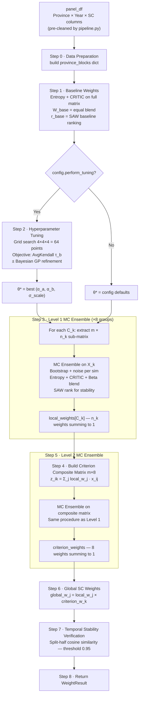

# Weighting Phase

**Status:** Production  
**Scope:** Two-level hierarchical weight calculation — Level 1: 29 sub-criteria local weights per criterion group; Level 2: 8 criterion global weights (63 provinces × 14 years)

---

## 1. Overview

### What this phase does

The weighting phase determines how important each sub-criterion (SC) and each criterion (C) is relative to the others. It produces two sets of weights:

- **Level 1 local weights** — within each of the 8 criterion groups (C01–C08), how much each SC contributes relative to the other SCs in that group. These drive the Stage 1 MCDM ranking.
- **Level 2 criterion weights** — how important each of the 8 criteria is globally. These drive Stage 2 Evidential Reasoning aggregation.

A third set, **global SC weights**, is derived by multiplying the two levels together: $w_j = u_{k,j} \times v_k$. These 29 global weights are what `pipeline.py` ultimately receives.

### Two-level hierarchy

```
  LEVEL 2 (criterion weights — used by ER Stage 2)
  +------+------+------+------+------+------+------+------+
  | C01  | C02  | C03  | C04  | C05  | C06  | C07  | C08  |
  | v_1  | v_2  | v_3  | v_4  | v_5  | v_6  | v_7  | v_8  |
  +--+---+--+---+--+---+--+---+--+---+--+---+--+---+--+---+
     |      |      |      |      |      |      |      |
  LEVEL 1 (local SC weights — used by MCDM Stage 1)
  [SC11   [SC21   [SC31   [SC41   [SC51   [SC61   [SC71   [SC81
   SC12    SC22    SC32    SC42    SC52    SC62    SC72    SC82
   SC13    SC23    SC33    SC43    SC53    SC63    SC73    SC83]
   SC14]   SC24]           SC44]   SC54]   SC64]
  4 SCs   4 SCs   3 SCs   4 SCs   4 SCs   4 SCs   3 SCs   3 SCs
```

| Level | Weights produced | Sum constraint | Used in |
|---|---|---|---|
| Level 1 | Local SC weights per group | Sums to 1 within each $C_k$ | Stage 1: MCDM ranking |
| Level 2 | Criterion weights C01–C08 | Sums to 1 globally | Stage 2: ER aggregation |
| Global | 29 SC weights | Sums to 1 globally | `pipeline.py` (`WeightResult.weights`) |

### Method: Probabilistic Monte Carlo Ensemble

Each level is computed independently via the same **Monte Carlo ensemble** that combines two complementary objective weighting methods:

- **Shannon Entropy** — assigns higher weight to criteria with greater discriminating power (variance) across provinces.
- **CRITIC** — rewards criteria that are both highly variable *and* uncorrelated with other criteria.

For each simulation $s$, the ensemble:
1. Perturbs the input data (panel block bootstrap + log-normal multiplicative noise).
2. Computes Entropy weights $\mathbf{w}_E^{(s)}$ and CRITIC weights $\mathbf{w}_C^{(s)}$ on the perturbed data.
3. Blends them with a randomly sampled $\beta^{(s)} \sim \text{Beta}(\alpha_a, \alpha_b)$: $\mathbf{w}^{(s)} = \beta^{(s)} \mathbf{w}_E^{(s)} + (1-\beta^{(s)}) \mathbf{w}_C^{(s)}$.
4. Tracks the resulting ranking for stability measurement.

The final weights are the posterior mean $\bar{\mathbf{w}} = \frac{1}{N} \sum_s \mathbf{w}^{(s)}$ across all $N$ simulations.

### Input / Output summary

| Item | Detail |
|---|---|
| Input | `panel_df` — long-format panel (Province, Year, SC11–SC83), pre-cleaned by `pipeline.py` |
| Provinces $m$ | 63 |
| Years $T$ | 2011–2024 (14 years) |
| Total SCs $p$ | 29 (split 4-4-3-4-4-4-3-3 across 8 groups) |
| Output | `WeightResult` — 29 global SC weights + full MC diagnostics |

---

## 2. Algorithm — Step by Step

### Workflow diagram


```mermaid
flowchart TD
    A["panel_df\nProvince × Year × SC columns\n(pre-cleaned by pipeline.py)"]
    --> B["Step 0 · Data Preparation\nbuild province_blocks dict"]

    B --> C["Step 1 · Baseline Weights\nEntropy + CRITIC on full matrix\nW_base = equal blend\nr_base = SAW baseline ranking"]

    C --> D{"config.perform_tuning?"}
    D -- Yes --> E["Step 2 · Hyperparameter Tuning\nGrid search 4×4×4 = 64 points\nObjective: AvgKendall τ_b\n± Bayesian GP refinement"]
    E --> F["θ* = best (α_a, α_b, σ_scale)"]
    D -- No --> F2["θ* = config defaults"]
    F --> G
    F2 --> G

    subgraph L1["Step 3 · Level 1 MC Ensemble (×8 groups)"]
      G["For each C_k: extract m × n_k sub-matrix"]
      --> H["MC Ensemble on X_k\nBootstrap + noise per sim\nEntropy + CRITIC + Beta blend\nSAW rank for stability"]
      --> I["local_weights[C_k] — n_k weights summing to 1"]
    end

    I --> J["Step 4 · Build Criterion Composite Matrix m×8\nz_ik = Σ_j local_w_j · x_ij"]

    subgraph L2["Step 5 · Level 2 MC Ensemble"]
        J --> K["MC Ensemble on composite matrix\nSame procedure as Level 1"]
        --> L["criterion_weights — 8 weights summing to 1"]
    end

    L --> M["Step 6 · Global SC Weights\nglobal_w_j = local_w_j × criterion_w_k"]

    M --> N["Step 7 · Temporal Stability Verification\nSplit-half cosine similarity — threshold 0.95"]

    N --> O["Step 8 · Return WeightResult"]
```

---

### Step 0 — Data Preparation

**Purpose:** Extract the raw data matrix and build the province-block index used by all subsequent bootstrap operations.

The input `panel_df` is in long format with one row per (Province, Year) pair. This step groups all row indices belonging to each province into a `province_blocks` dictionary. These blocks are the exchangeability units for cross-sectional block bootstrap throughout the entire algorithm.

```
province_blocks ← {province_name: array_of_row_indices}   (63 entries)
all_sc_cols     ← flatten(criteria_groups.values())       (29 SC column names)
X_raw_all       ← panel_df[all_sc_cols].values            (m × 29 matrix)
```

> **Why province blocks?** Simple row-level bootstrap breaks the temporal correlation within each province (each province has 14 year-rows that are correlated). Since the ranking is *of provinces*, the correct bootstrap exchangeability unit is the entire province. Resampling complete province blocks preserves within-province temporal structure (Kunsch, 1989).

---

### Step 1 — Baseline Weights

**Purpose:** Establish a deterministic baseline ranking used as the reference for stability measurement during tuning.

Compute Entropy and CRITIC weights on the full, un-perturbed, globally normalized matrix, then blend them equally to produce a single baseline weight vector and a corresponding SAW ranking.

$$X_{\text{norm}} = \text{GlobalMinMax}(X_\text{raw}, \varepsilon)$$
$$\mathbf{W}_{\text{base}} = \frac{\mathbf{w}_E + \mathbf{w}_C}{2}, \quad \mathbf{W}_{\text{base}} \leftarrow \mathbf{W}_{\text{base}} / \|\mathbf{W}_{\text{base}}\|_1$$
$$\mathbf{r}_{\text{base}} = \text{rank}(-X_{\text{norm}} \cdot \mathbf{W}_{\text{base}})$$

This baseline ranking $\mathbf{r}_{\text{base}}$ is passed to the tuning step as the reference against which Kendall's $\tau_b$ is measured.

---

### Step 2 — Hyperparameter Tuning *(optional)*

**Purpose:** Find the combination of Beta distribution parameters $(\alpha_a, \alpha_b)$ and noise scale $\sigma_\text{scale}$ that maximises ranking stability under data perturbation.

**Activated only if** `config.perform_tuning = True`. Otherwise config defaults are used directly.

#### 2a. Objective

$$\theta^* = \arg\max_{\theta \in \Theta} \; \text{AvgKendall}(\theta), \quad \theta = (\alpha_a,\, \alpha_b,\, \sigma_{\text{scale}})$$

Estimated by running the Level 2 MC ensemble at $N_\text{tune} = 500$ simulations per candidate and measuring how closely the perturbed rankings agree with $\mathbf{r}_\text{base}$.

#### 2b. Coarse grid search

| Parameter | Grid |
|---|---|
| $\alpha_a$ (Entropy side) | `[0.5, 1.0, 2.0, 4.0]` |
| $\alpha_b$ (CRITIC side) | `[0.5, 1.0, 2.0, 4.0]` |
| $\sigma_\text{scale}$ | `[0.01, 0.03, 0.06, 0.10]` |

Total: $4 \times 4 \times 4 = 64$ points. Points with $\alpha_a + \alpha_b > 8$ (extreme concentration) or $\sigma_\text{scale} > 0.10$ (unrealistic noise) are pruned.

#### 2c. Bayesian refinement *(optional)*

If `config.use_bayesian_tuning = True` (requires `scikit-optimize`): the top 5 grid results seed a Gaussian Process (Matérn $\nu=2.5$), then 20 Expected-Improvement-guided evaluations refine $\theta^*$ within $[0.5, 5.0]^2 \times [0.005, 0.15]$. Falls back to grid-only with a logged warning if `scikit-optimize` is absent.

#### 2d. Output

$\theta^* = (\alpha_a^*, \alpha_b^*, \sigma_\text{scale}^*)$ — shared by both Level 1 and Level 2 inference.

---

### Step 3 — Level 1: Per-Criterion MC Ensemble

**Purpose:** For each of the 8 criterion groups, compute local SC weights — how much each SC contributes relative to the other SCs within its group.

The groups are processed independently. For each criterion group $C_k$:

1. **Extract sub-matrix** $X_k \in \mathbb{R}^{m \times n_k}$ using only the columns belonging to $C_k$.
2. **Run the MC ensemble** (`_run_mc_ensemble`) on $X_k$ with hyperparameters $\theta^*$ for $N$ simulations. The subroutine is described in detail in [Section 3](#3-mc-ensemble-subroutine).
3. **Store** the posterior mean weights $\bar{\mathbf{u}}_k \in \Delta^{n_k}$, which sum to 1 within the group.

**Output of this step:**

```
local_weights = {
    "C01": {"SC11": float, "SC12": float, "SC13": float, "SC14": float},  # sums to 1
    "C02": {"SC21": float, ...},
    ...
    "C08": {"SC81": float, "SC82": float, "SC83": float},
}
```

---

### Step 4 — Build Criterion Composite Matrix

**Purpose:** Collapse the $m \times 29$ SC panel into an $m \times 8$ criterion-level panel, where each column is a single score representing one criterion per province.

Using the Level 1 posterior-mean local weights, each criterion's composite score for province $i$ is the weighted sum of its SC values:

$$z_{ik} = \sum_{j \in \text{SC}_k} \bar{u}_{k,j} \cdot x_{ij}, \quad i = 1,\ldots,m, \quad k = 1,\ldots,K$$

where $x_{ij}$ are the raw (pre-normalization) SC values and $\bar{u}_{k,j}$ are the Level 1 local weights.

> **Design rationale:** The composite matrix $Z \in \mathbb{R}^{m \times 8}$ represents each criterion as a single score that already encodes the relative importance of its sub-criteria. Level 2 then determines how important each criterion is *relative to the others*, independently of the SC-level weights. This ensures the two levels are conceptually orthogonal.

---

### Step 5 — Level 2: Criterion MC Ensemble

**Purpose:** Determine the global importance of each criterion C01–C08 relative to one another.

Run the same MC ensemble subroutine on the composite matrix $Z \in \mathbb{R}^{m \times 8}$, treating each criterion column as if it were a sub-criterion. The province-block structure is identical; the same $\theta^*$ applies.

**Output of this step:**

```
criterion_weights = {
    "C01": float, "C02": float, ..., "C08": float   # sums to 1
}
```

Level 2 also produces the full province rank distribution (mean rank, std, top-1 probability, pairwise win matrix) from its SAW surrogate, since this is the final ranking signal.

---

### Step 6 — Global SC Weights

**Purpose:** Combine the two levels into a single weight for each of the 29 SCs that reflects both within-group and cross-group importance.

$$w_j = \bar{u}_{k,j} \cdot \bar{v}_k, \quad j \in \text{SC}_k$$

where $\bar{u}_{k,j}$ is the Level 1 local weight and $\bar{v}_k$ is the Level 2 criterion weight.

**Simplex property** (proven):

$$\sum_{k=1}^{K} \sum_{j \in \text{SC}_k} w_j = \sum_{k=1}^{K} \bar{v}_k \underbrace{\sum_{j \in \text{SC}_k} \bar{u}_{k,j}}_{=1} = \sum_{k=1}^{K} \bar{v}_k = 1$$

A floating-point re-normalization guard is applied (`global_sc_weights[sc] /= sum(...)`). By construction the sum is already $\approx 1.0$.

These 29 weights are stored in `WeightResult.weights` and passed directly to `HierarchicalRankingPipeline.rank()`.

---

### Step 7 — Temporal Stability Verification

**Purpose:** Verify that the weights are stable across time by checking whether weights computed on the first half of the time series (2011–2017) are consistent with weights from the second half (2018–2024).

A `TemporalStabilityValidator` splits `panel_df` at the midpoint and calls `compute_weights` on each half via a callback. The callback uses the already-tuned $\theta^*$ with `perform_tuning=False` and `mc_n_simulations=200` to avoid re-running the expensive tuning grid.

**Stability metrics:**

| Field | Meaning |
|---|---|
| `cosine_similarity` | Cosine similarity between early-half and late-half weight vectors |
| `pearson_correlation` | Pearson $r$ between early-half and late-half weight vectors |
| `is_stable` | `True` if cosine similarity $\geq$ `config.stability_threshold` (default 0.95) |
| `split_point` | Year used as split boundary |

---

### Step 8 — Return `WeightResult`

Assemble and return the final result object:

```python
WeightResult(
    weights = global_sc_weights,        # 29 global SC weights, sums to 1
    method  = "monte_carlo_ensemble",
    details = {
        "level1":            ...,       # per-group local weights + MC diagnostics
        "level2":            ...,       # criterion weights + MC diagnostics
        "global_sc_weights": ...,       # same as .weights
        "hyperparameters":   ...,       # θ* and tuning metadata
        "stability":         ...,       # temporal stability result
        "n_observations":    int,
        "n_criteria_groups": 8,
        "n_subcriteria":     29,
        "n_provinces":       63,
        "n_years":           14,
    }
)
```

Full `details` schema is in [Section 5 — Output Specification](#5-output-specification).

---

## 3. MC Ensemble Subroutine

The subroutine `_run_mc_ensemble(X, province_blocks, col_names, θ, config)` implements a single level's full Monte Carlo loop. It is called once per Level 1 criterion group and once for Level 2.

### Per-simulation procedure

For each simulation $s = 1, \ldots, N$:

#### 3a. Cross-sectional block bootstrap

Resample the 63 province blocks with replacement to form a new $m$-row matrix:

$$\mathcal{I}^{(s)} \sim \text{Multinomial}(B;\, \tfrac{1}{B}, \ldots, \tfrac{1}{B}) \text{ with replacement}$$

Stack all year-rows for each selected province block. This preserves within-province temporal structure while introducing cross-sectional variability.

> Resampling complete province blocks is the statistically valid exchangeability unit: under the null hypothesis that provinces are i.i.d. draws from a population, block-resampling is exchangeable (Kunsch, 1989; Politis & Romano, 1994).

#### 3b. Log-normal multiplicative noise

Apply column-wise noise to the bootstrapped matrix:

$$X^{(s)}_{ij} = X^{(s)}_{\text{boot},ij} \times \exp\!\left(\varepsilon_{ij}^{(s)}\right), \quad \varepsilon_{ij}^{(s)} \sim \mathcal{N}\!\left(0,\; \sigma_{\text{scale}}^2 \cdot \hat{\sigma}_j^2 \right)$$

where $\hat{\sigma}_j$ is the sample standard deviation of column $j$ after global normalization.

> **Why log-normal, not Gaussian?** Additive Gaussian noise can produce negative values, violating the strict positivity requirement of both Entropy and CRITIC. Log-normal multiplicative noise satisfies $X^{(s)} = X_\text{boot} \odot e^\varepsilon > 0$ always, and is the natural perturbation model for positive socioeconomic measurements.

#### 3c. Normalize

$$\tilde{X}^{(s)} = \text{GlobalMinMax}(X^{(s)}, \varepsilon), \quad \tilde{x}_{ij} = \frac{x_{ij} - \min(X^{(s)})}{\max(X^{(s)}) - \min(X^{(s)})} + \varepsilon$$

#### 3d. Compute base method weights

**Entropy weight formula:**

$$p_{ij} = \frac{\tilde{x}_{ij}}{\sum_{i'} \tilde{x}_{i'j}}, \quad E_j = -\frac{1}{\ln m} \sum_{i=1}^{m} p_{ij} \ln(p_{ij} + \varepsilon), \quad w_{E,j} = \frac{1 - E_j}{\sum_{j'}(1 - E_{j'})}$$

**CRITIC weight formula:**

$$C_j = \sigma_j \sum_{j'} (1 - r_{jj'}), \quad w_{C,j} = \frac{C_j}{\sum_{j''} C_{j''}}$$

where $\sigma_j$ is the standard deviation of column $j$ and $r_{jj'}$ is the Pearson correlation between columns $j$ and $j'$.

#### 3e. Sample blend parameter

$$\beta^{(s)} \sim \text{Beta}(\alpha_a, \alpha_b)$$

| $(\alpha_a, \alpha_b)$ | $\mathbb{E}[\beta]$ | Behaviour |
|---|---|---|
| (1, 1) | 0.5 | Uniform — equal treatment of both methods |
| (2, 2) | 0.5 | Concentrated near equal blend |
| (3, 1) | 0.75 | Entropy-dominant |
| (1, 3) | 0.25 | CRITIC-dominant |
| (0.5, 0.5) | 0.5 | Bimodal — strong method preference per simulation |

#### 3f. Blend weights

**Primary (linear):**

$$\mathbf{w}^{(s)}_\text{raw} = \beta^{(s)} \mathbf{w}_E^{(s)} + (1 - \beta^{(s)}) \mathbf{w}_C^{(s)}, \quad \mathbf{w}^{(s)} = \mathbf{w}^{(s)}_\text{raw} / \|\mathbf{w}^{(s)}_\text{raw}\|_1$$

Since $\mathbf{w}_E^{(s)}, \mathbf{w}_C^{(s)} \in \Delta^p$ and $\beta^{(s)} \in [0,1]$, the convex combination is already in $\Delta^p$ exactly; re-normalization is a floating-point safety step only.

**Automatic multiplicative fallback** (triggered only on numerical failure of the linear blend):

$$w_j^{(s)} = \frac{w_{E,j}^{(s)} \cdot w_{C,j}^{(s)}}{\sum_{k} w_{E,k}^{(s)} \cdot w_{C,k}^{(s)}}$$

A sub-criterion must score highly in *both* methods to receive high weight under this formula. This is not a configurable mode — it is a silent numeric recovery path.

#### 3g. SAW surrogate ranking

$$S_i^{(s)} = \sum_j w_j^{(s)} \tilde{x}_{ij}^{(s)}, \quad \mathbf{r}^{(s)} = \text{rank}(-\mathbf{S}^{(s)})$$

SAW is used as the stability surrogate because it is the linear scorer most sensitive to weight changes, making it the correct fast proxy for detecting weight-induced rank instability.

### Convergence check

After every `conv_check_every = max(10, N//20)` successful iterations (starting from `conv_min_iters = max(30, N//6)`):

$$\delta^{(b)} = \|\bar{\mathbf{w}}^{(b)} - \bar{\mathbf{w}}^{(b-1)}\|_\infty < \delta_\text{tol} = 5 \times 10^{-5}$$

Two consecutive checks passing triggers early termination; `converged_at` is recorded in diagnostics.

### Failed simulation handling

If `EntropyWeightCalculator` or `CRITICWeightCalculator` raises any exception: catch, increment `failed_count`, continue. If success rate `OK / N < 0.80`, log `WARNING` and set `quality_flag = "low_convergence"` in MC diagnostics.

### Subroutine output

Returns a `DiagnosticsResult` containing:

| Field | Description |
|---|---|
| `mean_weights` | $\bar{\mathbf{w}} = \frac{1}{N}\sum_s \mathbf{w}^{(s)}$ — point estimate |
| `std_weights` | Posterior standard deviation per weight |
| `ci_lower_2_5`, `ci_upper_97_5` | 95% equal-tailed credible intervals (via `np.percentile`) |
| `cv_weights` | Coefficient of variation $= \hat\sigma_{w_j} / \bar{w}_j$ |
| `avg_kendall_tau` | Mean Kendall's $\tau_b$ against baseline ranking |
| `avg_spearman_rho` | Mean Spearman $\rho$ against baseline ranking |
| `kendall_w` | Kendall's $W$ concordance across all $N$ simulations |
| `top_k_rank_var` | Mean rank variance for top-$K$ provinces |
| `province_mean_rank`, `province_std_rank` | Per-province rank distribution |
| `prob_top1`, `prob_topK` | Per-province probability of ranking 1st / top-$K$ |
| `rank_win_matrix` | $m \times m$ pairwise win probability $P_{ij} = P(\text{province } i \text{ outranks } j)$ |
| `converged_at` | Iteration at early stopping, or `None` |
| `n_completed` | Number of successful simulations |

> **ETI vs HDI:** Equal-tailed intervals are used because the weight posterior is expected to be unimodal and near-symmetric; ETI is the standard for bootstrap credible intervals (Davison & Hinkley, 1997). For $N = 2000$, the MCSE of the 2.5th percentile is $\approx 0.011\,\hat\sigma_{w_j}$, negligible in practice.

---

## 4. Hyperparameters

| Parameter | Symbol | Default | Role |
|---|---|---|---|
| MC simulations | $N$ | 2000 | Full inference iterations per level |
| Tuning simulations | $N_\text{tune}$ | 500 | Per grid-point iteration count |
| Beta shape 1 | $\alpha_a$ | 1.0 | Blend distribution — Entropy side |
| Beta shape 2 | $\alpha_b$ | 1.0 | Blend distribution — CRITIC side |
| Noise scale | $\sigma_\text{scale}$ | 0.02 | Log-normal noise magnitude |
| Bootstrap fraction | $f_\text{boot}$ | 1.0 | Province bootstrap resample ratio |
| Top-K for stability | $K$ | 10 | Rank variance window size |
| Stability threshold | — | 0.95 | Minimum cosine similarity for temporal stability pass |
| Convergence tolerance | $\delta_\text{tol}$ | $5\times10^{-5}$ | $L^\infty$ threshold for early stopping |

> **Why $N = 2000$?** For $p = 29$ and a 95% ETI, the MCSE of the CI endpoint is $\approx 0.011\,\hat\sigma_{w_j}$ — negligible in practice. $N = 2000$ gives stable Kendall's $W$ for $m = 63$. Early stopping typically terminates at 800–1200 iterations.

> **Why $\sigma_\text{scale} = 0.02$ default?** Approximately ±2% multiplicative noise relative to each column's standard deviation. On normalized scale (typical column std ≈ 0.2–0.4), absolute noise ≈ 0.004–0.008 — physically plausible for socioeconomic measurement uncertainty. The tuning grid finds the optimal $\sigma_\text{scale}$ for this specific panel.

---

## 5. Output Specification

```python
details = {
    # Level 1: per-criterion group results
    "level1": {
        "C01": {
            "local_sc_weights": {"SC11": float, "SC12": float, ...},  # sums to 1
            "mc_diagnostics": {
                "n_simulations_completed": int,
                "converged_at":            int | None,
                "mean_weights":   {"SC11": float, ...},
                "std_weights":    {"SC11": float, ...},
                "ci_lower_2_5":   {"SC11": float, ...},
                "ci_upper_97_5":  {"SC11": float, ...},
                "cv_weights":     {"SC11": float, ...},
                "avg_kendall_tau":  float,
                "avg_spearman_rho": float,
                "kendall_w":        float,
                "top_k_rank_var":   float,
            },
        },
        # C02 through C08 — identical structure
    },

    # Level 2: criterion weights + province rank distributions
    "level2": {
        "criterion_weights": {"C01": float, ..., "C08": float},  # sums to 1
        "mc_diagnostics": {
            "n_simulations_completed": int,
            "converged_at":            int | None,
            "mean_weights":   {"C01": float, ...},
            "std_weights":    {"C01": float, ...},
            "ci_lower_2_5":   {"C01": float, ...},
            "ci_upper_97_5":  {"C01": float, ...},
            "cv_weights":     {"C01": float, ...},
            "avg_kendall_tau":  float,
            "avg_spearman_rho": float,
            "kendall_w":        float,
            "top_k_rank_var":   float,
            # Province rank distributions (from Level 2 SAW surrogate)
            "province_mean_rank":  {"Hanoi": float, ...},
            "province_std_rank":   {"Hanoi": float, ...},
            "province_prob_top1":  {"Hanoi": float, ...},
            "province_prob_topK":  {"Hanoi": float, ...},
            # P[i][j] = P(province i outranks province j) across simulations
            "rank_win_matrix": {"Hanoi": {"Ho Chi Minh City": float, ...}, ...},
        },
    },

    # Global SC weights (Level 1 × Level 2 product)
    "global_sc_weights": {"SC11": float, ..., "SC83": float},  # sums to 1

    # Hyperparameters used (θ* and tuning metadata)
    "hyperparameters": {
        "beta_a":              float,
        "beta_b":              float,
        "noise_sigma_scale":   float,
        "boot_fraction":       float,
        "tuning_performed":    bool,
        "tuning_objective":    str,
        "tuning_grid_size":    int,
        "tuning_best_score":   float,
    },

    # Temporal stability check result
    "stability": {
        "cosine_similarity":   float | None,
        "pearson_correlation": float | None,
        "is_stable":           bool  | None,
        "split_point":         int   | None,
        "note":                str,
    },

    # Metadata
    "n_observations":    int,
    "n_criteria_groups": int,   # = 8
    "n_subcriteria":     int,   # = 29
    "n_provinces":       int,   # = 63
    "n_years":           int,   # = 14
}
```

**What `pipeline.py` reads from `details`:**

| Read path | Used for |
|---|---|
| `details["global_sc_weights"][sc]` | SC weights for Stage 1 MCDM |
| `details["level2"]["criterion_weights"][ck]` | Criterion weights for Stage 2 ER |
| `details["level2"]["mc_diagnostics"]["avg_kendall_tau"]` | Stability report |
| `details["stability"]["is_stable"]` | Temporal stability flag |
| `details["hyperparameters"]` | Pipeline run summary log |

---

## 6. Configuration (`WeightingConfig`)

```python
@dataclass
class WeightingConfig:
    """Monte Carlo Entropy–CRITIC Ensemble Weighting configuration."""

    # Core MC parameters
    mc_n_simulations: int = 2000        # N: full inference iterations per level
    mc_n_tuning_simulations: int = 500  # N_tune: per grid-point simulations

    # Beta blending prior
    beta_a: float = 1.0    # α_a (Entropy side);  Beta(1,1) = Uniform(0,1)
    beta_b: float = 1.0    # α_b (CRITIC side)

    # Data perturbation
    noise_sigma_scale: float = 0.02   # σ_scale: fraction of column std
    boot_fraction: float = 1.0        # province resample ratio

    # Tuning
    perform_tuning: bool = True
    use_bayesian_tuning: bool = False   # requires scikit-optimize
    tuning_objective: Literal[
        "avg_kendall_tau",
        "avg_spearman_rho",
        "top_k_rank_var",
    ] = "avg_kendall_tau"
    top_k_stability: int = 10

    # Stability verification
    stability_threshold: float = 0.95

    # Convergence
    convergence_tolerance: float = 5e-5
    conv_min_iters_fraction: float = 1 / 6   # start checking after N//6 iters

    # Numerics
    epsilon: float = 1e-10
    seed: int | None = None             # RandomState seed for reproducibility
```

---

## 7. Module Structure

| File | Role |
|---|---|
| `weighting/hybrid_weighting.py` | `HybridWeightingCalculator` — main two-level MC ensemble |
| `weighting/entropy.py` | `EntropyWeightCalculator` — Shannon entropy weights |
| `weighting/critic.py` | `CRITICWeightCalculator` — CRITIC weights |
| `weighting/adaptive.py` | `AdaptiveWeightCalculator` — NaN-aware utility; `'hybrid'` mode = geometric mean of Entropy + CRITIC |
| `weighting/bootstrap.py` | Bayesian bootstrap weight sampling |
| `weighting/validation.py` | `temporal_stability_verification` — split-half cosine metric |
| `weighting/normalization.py` | `global_min_max_normalize`, `GlobalNormalizer` |
| `weighting/base.py` | `WeightResult` dataclass; `calculate_weights` convenience function |
| `weighting/__init__.py` | Module exports |
| `config.py` | `WeightingConfig` dataclass |
| `pipeline.py` | Orchestration — calls `HybridWeightingCalculator`, reads `details` |
| `ranking/pipeline.py` | `_derive_hierarchical_weights()` — receives criterion weights from `details["level2"]` |
| `tests/test_weighting.py` | `TestHybridWeightingCalculator`, `TestEntropyWeightCalculator`, `TestCRITICWeightCalculator` |

---

## 8. Implementation Notes

### Province-block bootstrap with variable block sizes

Some province × year combinations are excluded by the pre-filter in `pipeline.py`. Province blocks are built from actual row indices in the pre-filtered `panel_df`. The stacked bootstrap matrix has $m = \sum_k |\text{block}[k]|$ rows, which may vary if blocks have different sizes. `GlobalMinMax` normalization is applied after stacking.

### Minimum province count fallback

If fewer than 10 distinct provinces remain after NaN exclusion, cross-sectional block bootstrap degenerates. Fall back to standard Dirichlet row-level resampling and log `WARNING`. Handles degenerate unit-test inputs.

### CRITIC ill-conditioning under extreme bootstrap draws

Repeated province blocks may cause columns to become near-constant ($\sigma_j \to 0$). Guard in `CRITICWeightCalculator`: constant columns receive $C_j = \varepsilon$. No additional handling is needed.

### `pipeline.py` weight extraction

```python
# Extract global SC weights and criterion weights from WeightResult.details:
global_sc_w = result.details["global_sc_weights"]
sc_weights  = np.array([global_sc_w[c] for c in subcriteria])

criterion_w = result.details["level2"]["criterion_weights"]
```

Add `mc_ensemble_diagnostics: Optional[Dict] = None` to `PipelineResult` to surface `details["level2"]["mc_diagnostics"]` for visualization and reporting.

### `ranking/pipeline.py` — `_derive_hierarchical_weights()` update

After migration, this method receives criterion weights directly from `details["level2"]["criterion_weights"]` rather than deriving them by summing SC weights:

```python
def _derive_hierarchical_weights(
    self,
    subcriteria_weights: Dict[str, float],   # 29 global SC weights
    criterion_weights: Dict[str, float],     # 8 criterion weights from Level 2
    hierarchy: HierarchyMapping,
    ctx: YearContext,
) -> HierarchicalWeights:
    # Uses criterion_weights directly — no summation derivation
```

### Pairwise win matrix serialisation

For $m = 63$: $63 \times 63 = 3{,}969$ floats — trivially small. Store as `{province: {province: float}}` nested dict in `details["level2"]["mc_diagnostics"]["rank_win_matrix"]`. Keep internally as an $(m, m)$ NumPy array.

### Temporal stability verification callback

The callback passed to `TemporalStabilityValidator` calls `MonteCarloEnsembleWeighting` with `perform_tuning=False` and `mc_n_simulations=200`, using the already-tuned $\theta^*$ from Step 2. This avoids re-running the expensive tuning grid on the split-half data.

---

## 9. Statistical Validity Checklist

| Requirement | Status | Notes |
|---|---|---|
| Bootstrap exchangeability unit is correct | ✓ | Province-block resampling — provinces are the i.i.d. population units |
| Positivity preservation | ✓ | Log-normal noise: $X^{(s)} = X_\text{boot} \odot e^\varepsilon > 0$ always |
| Simplex constraint — Level 1 | ✓ | Each group's local weights sum to 1; proved via convex combination |
| Simplex constraint — Level 2 | ✓ | Criterion weights sum to 1; same proof |
| Simplex constraint — Global | ✓ | $\sum_k v_k \sum_{j \in k} u_{k,j} = \sum_k v_k \cdot 1 = 1$ |
| CI width controlled by $N$ | ✓ | $N = 2000$: MCSE of 2.5th pct $< 1.1\%$ of posterior std |
| Rank correlation handles ties | ✓ | Kendall's $\tau_b$ with tie correction via `scipy.stats.kendalltau` |
| Convergence criterion on posterior mean | ✓ | $L^\infty < 5 \times 10^{-5}$; checked every $N/20$ from $N/6$ |
| Tuning separated from inference | ✓ | Tuning uses $N_\text{tune} = 500$; inference uses $N = 2000$ on same data |
| No future data leakage | ✓ | Tuning objective is a procedure property; no predictive outcome involved |
| Level 2 input constructed from Level 1 | ✓ | Composite matrix $Z$ built from Level 1 posterior-mean local weights |
| Failed-simulation robustness | ✓ | Try/except per simulation; quality flag if `OK/N < 0.80` |
| Temporal stability verified | ✓ | Split-half test via `TemporalStabilityValidator`; callback uses $\theta^*$ |
| Reproducibility | ✓ | Controlled by `config.seed` via `np.random.RandomState` |

---

## 10. References

1. Shannon, C.E. (1948). A Mathematical Theory of Communication. *Bell System Technical Journal*, 27(3), 379–423.
2. Diakoulaki, D., Mavrotas, G., & Papayannakis, L. (1995). Determining objective weights in multiple criteria problems: The CRITIC method. *Computers & Operations Research*, 22(7), 763–770.
3. Kunsch, H.R. (1989). The Jackknife and the Bootstrap for General Stationary Observations. *Annals of Statistics*, 17(3), 1217–1241.
4. Politis, D.N. & Romano, J.P. (1994). The Stationary Bootstrap. *Journal of the American Statistical Association*, 89(428), 1303–1313.
5. Kendall, M.G. (1938). A new measure of rank correlation. *Biometrika*, 30(1/2), 81–93.
6. Kendall, M.G. & Babington Smith, B. (1939). The problem of m rankings. *Annals of Mathematical Statistics*, 10(3), 275–287.
7. Davison, A.C. & Hinkley, D.V. (1997). *Bootstrap Methods and Their Application*. Cambridge University Press.
8. Mockus, J. (1994). Application of Bayesian approach to numerical methods of global and stochastic optimization. *Journal of Global Optimization*, 4(4), 347–365.
9. Snoek, J., Larochelle, H., & Adams, R.P. (2012). Practical Bayesian Optimization of Machine Learning Algorithms. *NeurIPS 2012*, 2951–2959.
