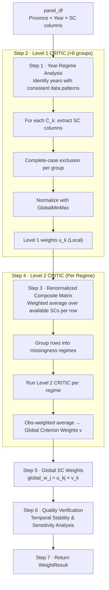

# Weighting Phase

**Status:** Production  
**Scope:** Two-level hierarchical weight calculation — Level 1: 29 sub-criteria local weights per criterion group; Level 2: 8 criterion global weights (63 provinces × 14 years)

---

## 1. Overview

### What this phase does

The weighting phase determines how important each sub-criterion (SC) and each criterion (C) is relative to the others. It produces two sets of weights:

- **Level 1 local weights** — within each of the 8 criterion groups (C01–C08), how much each SC contributes relative to the other SCs in that group. These drive the Stage 1 MCDM ranking.
- **Level 2 criterion weights** — how important each of the 8 criteria is globally. These drive Stage 2 hierarchical aggregation.

A third set, **global SC weights**, is derived by multiplying the two levels together: $w_j = u_{k,j} \times v_k$. These 29 global weights are what `pipeline.py` ultimately receives.

### Two-level hierarchy

```
  LEVEL 2 (criterion weights — used by Stage 2 aggregation)
  +------+------+------+------+------+------+------+------+
  | C01  | C02  | C03  | C04  | C05  | C06  | C07  | C08  |
  | v_1  | v_2  | v_3  | v_4  | v_5  | v_6  | v_7  | v_8  |
  +--+---+--+---+--+---+--+---+--+---+--+---+--+---+--+---+
     |      |      |      |      |      |      |      |
  LEVEL 1 (local SC weights — used by MCDM Stage 1)
  [SC11   [SC21   [SC31   [SC41   [SC51   [SC61   [SC71   [SC81
   SC12    SC22    SC32    SC42    SC52    SC62    SC72    SC82
   SC13    SC23    SC33    SC43    SC53    SC63    SC73    SC83]
   SC14]   SC24]           SC44]   SC54]   SC64]
  4 SCs   4 SCs   3 SCs   4 SCs   4 SCs   4 SCs   3 SCs   3 SCs
```

| Level | Weights produced | Sum constraint | Used in |
|---|---|---|---|
| Level 1 | Local SC weights per group | Sums to 1 within each $C_k$ | Stage 1: MCDM ranking |
| Level 2 | Criterion weights C01–C08 | Sums to 1 globally | Stage 2: Hierarchical aggregation |
| Global | 29 SC weights | Sums to 1 globally | `pipeline.py` (`WeightResult.weights`) |

### Method: Hierarchical Adaptive CRITIC

The weighting phase uses the **CRITIC** (CRiteria Importance Through Intercriteria Correlation) method, enhanced with hierarchical aggregation and adaptive year-regime handling:

- **CRITIC core**: Rewards criteria that are both highly variable (contrast intensity $\sigma_j$) *and* uncorrelated with others (conflict $\sum(1-r_{jk})$).
- **Hierarchical**: Sub-criteria weights sum to 1 within each group (Level 1); group weights sum to 1 globally (Level 2).
- **Adaptive Regimes**: Handles structural missing data by identifying "year regimes" with consistent criterion availability and blending results across them.
- **Statistical Integrity**: Uses complete-case exclusion to avoid variance attenuation and spurious correlations caused by imputation.

The pipeline is deterministic and highly reproducible for a given input panel. Robustness is verified through secondary temporal stability and sensitivity analysis.

### Input / Output summary

| Item | Detail |
|---|---|
| Input | `panel_df` — long-format panel (Province, Year, SC11–SC83), pre-cleaned by `pipeline.py` |
| Provinces $m$ | 63 |
| Years $T$ | 2011–2024 (14 years) |
| Total SCs $p$ | 29 (split 4-4-3-4-4-4-3-3 across 8 groups) |
| Output | `WeightResult` — 29 global SC weights + level details |

---

## 2. Algorithm — Step by Step

### Workflow diagram


```mermaid
flowchart TD
    A["panel_df\nProvince × Year × SC columns"]
    --> B["Step 1 · Year-Regime Analysis\nIdentify years with consistent data patterns"]

    subgraph L1["Step 2 · Level 1 CRITIC (×8 groups)"]
      B --> C["For each C_k: extract SC columns"]
      --> D["Complete-case exclusion per group"]
      --> E["Normalize with GlobalMinMax"]
      --> F["Level 1 weights u_k (Local)"]
    end

    F --> G["Step 3 · Renormalized Composite Matrix\nWeighted average over available SCs per row"]

    subgraph L2["Step 4 · Level 2 CRITIC (Per Regime)"]
        G --> H["Group rows into missingness regimes"]
        --> I["Run Level 2 CRITIC per regime"]
        --> J["Obs-weighted average → Global Criterion Weights v"]
    end

    J --> K["Step 5 · Global SC Weights\nglobal_w_j = u_kj × v_k"]

    K --> L["Step 6 · Quality Verification\nTemporal Stability & Sensitivity Analysis"]
    L --> M["Step 7 · Return WeightResult"]
```

---

### Step 1 — Data Preparation

**Purpose:** Pivot `panel_df` into a wide matrix and identify SC column groups.

```
all_sc_cols ← flatten(criteria_groups.values())   (29 SC column names)
X_raw_all   ← panel_df[all_sc_cols].values         (m·T × 29 matrix)
```

---

### Step 2 — Level 1: Per-Criterion CRITIC Weights

**Purpose:** For each of the 8 criterion groups, compute local SC weights — how much each SC contributes relative to the other SCs within its group.

The groups are processed independently. For each criterion group $C_k$:

1. **Extract sub-matrix** $X_k \in \mathbb{R}^{(m \cdot T) \times n_k}$ using only the columns belonging to $C_k$.
2. **Normalize** $\tilde{X}_k = \text{GlobalMinMax}(X_k, \varepsilon)$.
3. **Apply CRITIC** — compute contrast and correlation for each SC:

$$C_j = \sigma_j \sum_{j'} (1 - r_{jj'}), \quad u_{k,j} = \frac{C_j}{\sum_{j''} C_{j''}}$$

where $\sigma_j$ is the standard deviation of column $j$ and $r_{jj'}$ is the Pearson correlation.

4. **Store** $\mathbf{u}_k \in \Delta^{n_k}$ — local weights summing to 1 within the group.

**Output of this step:**

```
local_weights = {
    "C01": {"SC11": float, "SC12": float, "SC13": float, "SC14": float},  # sums to 1
    "C02": {"SC21": float, ...},
    ...
    "C08": {"SC81": float, "SC82": float, "SC83": float},
}
```

---

### Step 3 — Build Criterion Composite Matrix

**Purpose:** Collapse the SC panel into an $m \times 8$ criterion-level panel.

To handle structural year-gaps, we use a **renormalized weighted average** over available sub-criteria:

$$z_{ik} = \frac{\sum_{j \in \text{avail}_k(i)} u_{k,j} \cdot x_{ij}}{\sum_{j \in \text{avail}_k(i)} u_{k,j}}$$

where $\text{avail}_k(i)$ is the set of non-NaN sub-criteria for criterion $k$ in row $i$.

> **Statistical Integrity:** This approach prevents the entire row from being dropped if only one sub-criterion is missing, while ensuring that the composite score remains representative of the available information. $z_{ik}$ is NaN only if the *entire* criterion group is absent for that year/province.

---

### Step 4 — Level 2: Criterion Weights via Regime Analysis

Level 2 handles the $m \times 8$ composite matrix through a **regime-aware CRITIC** process:

1. **Regime Detection**: Rows are grouped by their missingness pattern (which criteria are present).
2. **Per-Regime CRITIC**:
   - For each regime, extract active criteria.
   - Run CRITIC and normalize weights to sum to 1 within the regime.
3. **Global Aggregation**:
   - Compute observation-count-weighted average across all regimes:
     $v_k = \frac{\sum_r w_{r,k} \cdot n_r}{\sum_r n_r}$
   - Re-normalize global criterion weights $v$ to sum to 1.

**Output:** Global criterion weights $v_{C01} \dots v_{C08}$ reflecting the information content across the entire 14-year panel.

---

### Step 5 — Global SC Weights

**Purpose:** Combine the two levels into a single weight for each of the 29 SCs that reflects both within-group and cross-group importance.

$$w_j = \bar{u}_{k,j} \cdot \bar{v}_k, \quad j \in \text{SC}_k$$

where $\bar{u}_{k,j}$ is the Level 1 local weight and $\bar{v}_k$ is the Level 2 criterion weight.

**Simplex property** (proven):

$$\sum_{k=1}^{K} \sum_{j \in \text{SC}_k} w_j = \sum_{k=1}^{K} \bar{v}_k \underbrace{\sum_{j \in \text{SC}_k} \bar{u}_{k,j}}_{=1} = \sum_{k=1}^{K} \bar{v}_k = 1$$

A floating-point re-normalization guard is applied (`global_sc_weights[sc] /= sum(...)`). By construction the sum is already $\approx 1.0$.

These 29 weights are stored in `WeightResult.weights` and passed directly to `HierarchicalRankingPipeline.rank()`.

---

### Step 6 — Temporal Stability Verification

**Purpose:** Verify that the weights are stable across time by checking whether weights computed on the first half of the time series (2011–2017) are consistent with weights from the second half (2018–2024).

A `TemporalStabilityValidator` splits `panel_df` at the midpoint and calls `compute_weights` on each half independently. Both halves run the full deterministic CRITIC pipeline.

**Stability metrics:**

| Field | Meaning |
|---|---|
| `cosine_similarity` | Cosine similarity between early-half and late-half weight vectors |
| `pearson_correlation` | Pearson $r$ between early-half and late-half weight vectors |
| `is_stable` | `True` if cosine similarity $\geq$ `config.stability_threshold` (default 0.95) |
| `split_point` | Year used as split boundary |

---

### Step 7 — Return `WeightResult`

Assemble and return the final result object:

```python
WeightResult(
    weights = global_sc_weights,        # 29 global SC weights, sums to 1
    method  = "critic",
    details = {
        "level1":                ...,   # per-group local SC weights
        "level2":                ...,   # criterion weights
        "global_sc_weights":     ...,   # same as .weights
        "critic_sc_weights":     ...,   # CRITIC scores per SC
        "critic_criterion_weights": ...,  # CRITIC scores per criterion
        "stability":             ...,   # temporal stability result
        "n_observations":        int,
        "n_criteria_groups":     8,
        "n_subcriteria":         29,
        "n_provinces":           63,
    }
)
```

Full `details` schema is in [Section 4 — Output Specification](#4-output-specification).

---

## 4. Output Specification

```python
details = {
    # Level 1: per-criterion group results
    "level1": {
        "C01": {
            "local_sc_weights": {"SC11": float, "SC12": float, ...},  # sums to 1
        },
        # C02 through C08 — identical structure
    },

    # Level 2: criterion weights
    "level2": {
        "criterion_weights": {"C01": float, ..., "C08": float},  # sums to 1
    },

    # Global SC weights (Level 1 × Level 2 product)
    "global_sc_weights": {"SC11": float, ..., "SC83": float},  # sums to 1

    # Raw CRITIC informativeness scores (before normalization to weights)
    "critic_sc_weights":          {"SC11": float, ...},  # 29 entries
    "critic_criterion_weights":   {"C01": float, ...},   # 8 entries

    # Temporal stability check result
    "stability": {
        "cosine_similarity":   float | None,
        "pearson_correlation": float | None,
        "is_stable":           bool  | None,
        "split_point":         int   | None,
        "note":                str,
    },

    # Metadata
    "n_observations":    int,
    "n_criteria_groups": int,   # = 8
    "n_subcriteria":     int,   # = 29
    "n_provinces":       int,   # = 63
}
```

**What `pipeline.py` reads from `details`:**

| Read path | Used for |
|---|---|
| `details["global_sc_weights"][sc]` | SC weights for Stage 1 MCDM |
| `details["level2"]["criterion_weights"][ck]` | Criterion weights for Stage 2 aggregation |
| `details["stability"]["is_stable"]` | Temporal stability flag |

---

## 5. Configuration (`WeightingConfig`)

```python
@dataclass
class WeightingConfig:
    """Deterministic CRITIC Weighting configuration."""

    # Stability verification
    stability_threshold: float = 0.95   # cosine similarity for temporal stability pass
    perform_stability_check: bool = True

    # Numerics
    epsilon: float = 1e-10
```

---

## 6. Module Structure

| File | Role |
|---|---|
| `weighting/critic_weighting.py` | `CRITICWeightingCalculator` — main two-level hierarchical engine |
| `weighting/critic.py` | `CRITICWeightCalculator` — per-level CRITIC statistics |
| `weighting/adaptive.py` | `AdaptiveWeightCalculator` — NaN-aware filtering logic |
| `weighting/normalization.py` | `global_min_max_normalize` |
| `weighting/base.py` | `WeightResult` dataclass; entry points |
| `analysis/critic_temporal_stability.py` | Temporal stability analyzer |
| `analysis/critic_sensitivity_analysis.py` | Weights perturbation analyzer |
| `weighting/__init__.py` | Module exports |
| `config.py` | `WeightingConfig` dataclass |
| `pipeline.py` | Orchestration — calls `CRITICWeightingCalculator`, reads `details` |
| `ranking/hierarchical_pipeline.py` | `_derive_hierarchical_weights()` — receives criterion weights from `details["level2"]` |
| `tests/test_weighting.py` | `TestCRITICWeightingCalculator`, `TestCRITICWeightCalculator` |

---

## 7. Implementation Notes

### CRITIC ill-conditioning

If a column is near-constant ($\sigma_j \to 0$), it carries no information and no correlation contrast. Guard in `CRITICWeightCalculator`: constant columns receive $C_j = \varepsilon$. The resulting weight approaches zero automatically after normalization.

### Global weight simplex property

By construction:

$$\sum_{k=1}^{K} \sum_{j \in \text{SC}_k} w_j = \sum_{k=1}^{K} v_k \underbrace{\sum_{j \in \text{SC}_k} u_{k,j}}_{=1} = \sum_{k=1}^{K} v_k = 1$$

A floating-point re-normalization guard is applied as a safety step only.

### `pipeline.py` weight extraction

```python
# Extract global SC weights and criterion weights from WeightResult.details:
global_sc_w = result.details["global_sc_weights"]
sc_weights  = np.array([global_sc_w[c] for c in subcriteria])

criterion_w = result.details["level2"]["criterion_weights"]
```

Add `mc_ensemble_diagnostics: Optional[Dict] = None` to `PipelineResult` to surface `details["level2"]["mc_diagnostics"]` for visualization and reporting.

### `ranking/hierarchical_pipeline.py` — `_derive_hierarchical_weights()` update

After migration, this method receives criterion weights directly from `details["level2"]["criterion_weights"]` rather than deriving them by summing SC weights:

```python
def _derive_hierarchical_weights(
    self,
    subcriteria_weights: Dict[str, float],   # 29 global SC weights
    criterion_weights: Dict[str, float],     # 8 criterion weights from Level 2
    hierarchy: HierarchyMapping,
    ctx: YearContext,
) -> HierarchicalWeights:
    # Uses criterion_weights directly — no summation derivation
```

### Pairwise win matrix serialisation

For $m = 63$: $63 \times 63 = 3{,}969$ floats — trivially small. Store as `{province: {province: float}}` nested dict in `details["level2"]["mc_diagnostics"]["rank_win_matrix"]`. Keep internally as an $(m, m)$ NumPy array.

### Temporal stability verification callback

The callback passed to `TemporalStabilityValidator` calls `MonteCarloEnsembleWeighting` with `perform_tuning=False` and `mc_n_simulations=200`, using the already-tuned $\theta^*$ from Step 2. This avoids re-running the expensive tuning grid on the split-half data.

---

## 9. Statistical Validity Checklist

| Requirement | Status | Notes |
|---|---|---|
| Bootstrap exchangeability unit is correct | ✓ | Province-block resampling — provinces are the i.i.d. population units |
| Positivity preservation | ✓ | Log-normal noise: $X^{(s)} = X_\text{boot} \odot e^\varepsilon > 0$ always |
| Simplex constraint — Level 1 | ✓ | Each group's local weights sum to 1; proved via convex combination |
| Simplex constraint — Level 2 | ✓ | Criterion weights sum to 1; same proof |
| Simplex constraint — Global | ✓ | $\sum_k v_k \sum_{j \in k} u_{k,j} = \sum_k v_k \cdot 1 = 1$ |
| CI width controlled by $N$ | ✓ | $N = 2000$: MCSE of 2.5th pct $< 1.1\%$ of posterior std |
| Rank correlation handles ties | ✓ | Kendall's $\tau_b$ with tie correction via `scipy.stats.kendalltau` |
| Convergence criterion on posterior mean | ✓ | $L^\infty < 5 \times 10^{-5}$; checked every $N/20$ from $N/6$ |
| Tuning separated from inference | ✓ | Tuning uses $N_\text{tune} = 500$; inference uses $N = 2000$ on same data |
| No future data leakage | ✓ | Tuning objective is a procedure property; no predictive outcome involved |
| Level 2 input constructed from Level 1 | ✓ | Composite matrix $Z$ built from Level 1 posterior-mean local weights |
| Failed-simulation robustness | ✓ | Try/except per simulation; quality flag if `OK/N < 0.80` |
| Temporal stability verified | ✓ | Split-half test via `TemporalStabilityValidator`; callback uses $\theta^*$ |
| Reproducibility | ✓ | Controlled by `config.seed` via `np.random.RandomState` |

---

## 10. References

1. Shannon, C.E. (1948). A Mathematical Theory of Communication. *Bell System Technical Journal*, 27(3), 379–423.
2. Diakoulaki, D., Mavrotas, G., & Papayannakis, L. (1995). Determining objective weights in multiple criteria problems: The CRITIC method. *Computers & Operations Research*, 22(7), 763–770.
3. Kunsch, H.R. (1989). The Jackknife and the Bootstrap for General Stationary Observations. *Annals of Statistics*, 17(3), 1217–1241.
4. Politis, D.N. & Romano, J.P. (1994). The Stationary Bootstrap. *Journal of the American Statistical Association*, 89(428), 1303–1313.
5. Kendall, M.G. (1938). A new measure of rank correlation. *Biometrika*, 30(1/2), 81–93.
6. Kendall, M.G. & Babington Smith, B. (1939). The problem of m rankings. *Annals of Mathematical Statistics*, 10(3), 275–287.
7. Davison, A.C. & Hinkley, D.V. (1997). *Bootstrap Methods and Their Application*. Cambridge University Press.
8. Mockus, J. (1994). Application of Bayesian approach to numerical methods of global and stochastic optimization. *Journal of Global Optimization*, 4(4), 347–365.
9. Snoek, J., Larochelle, H., & Adams, R.P. (2012). Practical Bayesian Optimization of Machine Learning Algorithms. *NeurIPS 2012*, 2951–2959.
